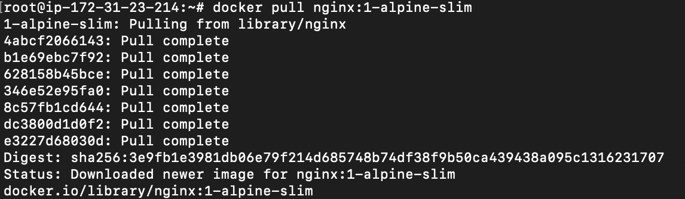
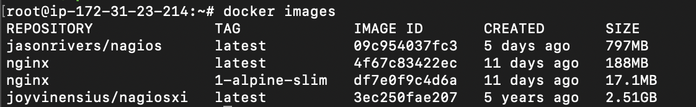

# Belajar Docker

## Create and Pull Docker Images

1. Docker pull

-  Mengunduh image dari Docker Hub atau registry lain.

```sh
docker pull IMAGE
```



2. Docker images

-  Menampilkan daftar image yang ada di sistem lokal.

```sh
docker images
```



3. Docker images

-  Menampilkan daftar container yang sedang running di sistem lokal.

```sh
docker container ls
```

-  Menampilkan daftar container yang sedang running dan tidak running di sistem lokal.

```sh
docker container ls --all
```

4. Docker container create

-  Membuat container dari images yang sudah ada di server

```sh
docker container create --name nginxjoy01 nginx:1-alpine-slim
```

5. Docker container run

-  Menjalankan container dari images yang sudah ada di server

```sh
docker container start nginxjoy01
```

6. Docker container rm dan stop

-  Menghapus container yang sudah ada di server

```sh
docker container rm nginxjoy01
```

note : sebelum menghapus container, anda harus memastikan container yang ingin di hapus harus dalam keadaan berhenti 

```sh
docker container stop nginxjoy01
```

## Membuka Port untuk Container

7. Docker container create

-  Membuat container dari images yang sudah ada di server

```sh
docker container create --name nginxjoy01 -p 8083:80 nginx:1-alpine-slim
```

8. Running container yang sudah di buat 

```sh
docker container start nginxjoy01 nginxjoy02
```

5. Docker build

-  Membangun image dari Dockerfile.

```sh
docker build [options] PATH | URL | -
```

6. Docker stop

-  Menghentikan container yang sedang berjalan. 

```sh
docker stop CONTAINER
```

7. Docker start

-  Menjalankan container yang telah dihentikan.

```sh
docker start CONTAINER
```

8. Docker rm

-  Menghapus container yang telah berhenti.

```sh
docker rm CONTAINER
```

9. Docker rmi

-  Menghapus image dari sistem lokal.

```sh
docker rmi IMAGE
```

10. Docker exec

-   Menjalankan perintah di dalam container yang sedang berjalan.

```sh
docker exec [options] CONTAINER COMMAND [ARG...]
```

11. Docker logs

-   Melihat log dari container.

```sh
docker logs CONTAINER
```

12. Docker network

-   Mengelola jaringan Docker.

```sh
docker network [COMMAND]
```

13. Docker volume

-   Mengelola volume Docker.

```sh
docker volume [COMMAND]
```

14. Docker-compose

-   Menggunakan Docker Compose untuk menjalankan aplikasi multi-container.

```sh
docker-compose up
docker-compose down
```

## Contoh Penggunaan

1. Menjalankan Container

-  Menjalankan container Nginx di latar belakang pada port 80.

```sh
docker run -d -p 80:80 nginx
```

2. Membangun Image

-  Membangun image dari Dockerfile di direktori saat ini.

```sh
docker build -t myapp .
```

3. Melihat Log Container

-  Melihat log dari container dengan nama atau ID tertentu.

```sh
docker logs mycontainer
```

4. Menggunakan Docker Compose

-  Menjalankan semua layanan yang ditentukan dalam docker-compose.yml.

```sh
docker-compose up
```

5. Masuk ke Shell dalam Container

-  Menjalankan bash di dalam container yang sedang berjalan.

```sh
docker exec -it mycontainer bash
```

Itu adalah beberapa perintah dasar yang dapat digunakan untuk bekerja dengan Docker. Tentu saja, Docker memiliki banyak perintah lain yang lebih spesifik untuk kebutuhan yang lebih lanjut. Anda dapat memeriksa dokumentasi Docker untuk informasi lebih lengkap dan mendetail.